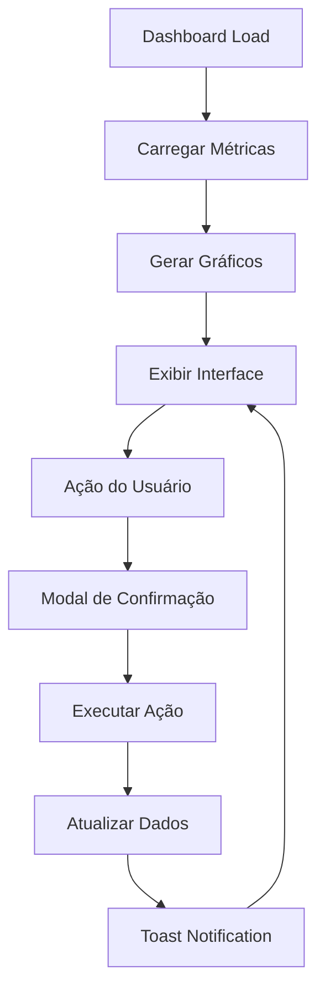

# 📊 Dashboard Super Admin - Omnigrejas

## 🎯 **Visão Geral**

O Dashboard Super Admin é uma **central de comando completa** para gerenciamento de assinaturas e monitoramento da plataforma Omnigrejas. Desenvolvido com **Livewire 3** e **Chart.js**, oferece uma interface moderna e interativa para administradores de alto nível.

## 🚀 **Principais Funcionalidades**

### **📈 Métricas em Tempo Real**
- **Receita Mensal:** Acompanhamento de vendas brutas
- **Novos Contratos:** Assinaturas criadas no período
- **Igrejas Ativas:** Status de aprovação e atividade
- **Taxa de Churn:** Percentual de cancelamentos
- **MRR (Monthly Recurring Revenue):** Receita recorrente mensal
- **Taxa de Renovação:** Percentual de renovações vs vencimentos

### **⚡ Ações Rápidas com Confirmação**
- **Sincronizar Pagamentos:** Atualiza dados do gateway
- **Gerar Relatórios:** Exporta dados completos
- **Renovar Assinaturas:** Extensão automática (+30 dias)
- **Resolver Falhas:** Marca problemas como resolvidos
- **Enviar Lembretes:** Notifica sobre vencimentos
- **Suspender Assinaturas:** Cancelamento imediato

### **📊 Gráficos Interativos**
- **Vendas Brutas:** Evolução temporal com filtros
- **Performance de Pacotes:** Distribuição por tipo
- **Crescimento de Usuários:** Novos cadastros
- **Métodos de Pagamento:** Preferências dos clientes
- **Distribuição Geográfica:** Localização das igrejas
- **Churn vs Retenção:** Análise de permanência

### **🔔 Sistema de Alertas**
- **Assinaturas Vencendo:** Próximos 7 e 30 dias
- **Falhas de Pagamento:** Problemas pendentes
- **Modal de Alertas Críticos:** Centralização de problemas
- **Toast Notifications:** Feedback visual das ações

## 🏗️ **Arquitetura Técnica**

### **Backend (Livewire)**
```php
// Estrutura Principal
App\Livewire\Admin\Super\Dashboard.php
├── Métricas Principais (receita, contratos, churn)
├── Gráficos Dinâmicos (Chart.js integration)
├── Ações Rápidas (CRUD operations)
├── Sistema de Confirmação (modals)
└── Notificações (toast system)

// Trait de Confirmação
App\Livewire\Admin\Super\DashboardConfirmation.php
├── Propriedades de Controle
├── Métodos de Confirmação
├── Execução de Ações
└── Reset de Estados
```

### **Frontend (Blade + JavaScript)**
```blade
resources/views/system/admin/super-admin/
├── dashboard.blade.php (interface principal)
├── dashboard-modals.blade.php (modais de confirmação)
└── components/ (cards, tabelas, gráficos)
```

### **Models Utilizadas**
- **AssinaturaAtual:** Assinaturas ativas
- **AssinaturaPagamento:** Transações financeiras
- **AssinaturaPagamentoFalha:** Problemas de pagamento
- **AssinaturaLog:** Histórico de ações
- **Igreja:** Dados das organizações
- **Pacote:** Planos de assinatura
- **User:** Usuários do sistema

## 🔧 **Implementação Detalhada**

### **1. Carregamento de Métricas**
```php
protected function carregarMetricas()
{
    // Receita confirmada do mês atual
    $this->receitaMesAtual = AssinaturaPagamento::where('status', 'confirmado')
        ->whereMonth('data_pagamento', now()->month)
        ->sum('valor');
    
    // MRR (Monthly Recurring Revenue)
    $this->mrr = AssinaturaAtual::where('status', 'Ativo')
        ->join('pacote', 'assinatura_atual.pacote_id', '=', 'pacote.id')
        ->sum(DB::raw('pacote.preco / COALESCE(pacote.duracao_meses, 1)'));
}
```

### **2. Gráficos Dinâmicos**
```javascript
const dashboardManager = {
    charts: {},
    
    init(chartData) {
        this.destroyAllCharts();
        this.initGrossSalesChart(chartData);
        this.initPerformancePacotesChart(chartData);
        // ... outros gráficos
    }
};
```

### **3. Sistema de Confirmação**
```php
public function confirmarRenovarAssinatura($assinaturaId, $nomeIgreja = 'Igreja')
{
    $this->showConfirmModal = true;
    $this->confirmAction = 'renovarAssinatura';
    $this->confirmTitle = 'Renovar Assinatura';
    $this->confirmMessage = "Tem certeza que deseja renovar a assinatura da {$nomeIgreja}?";
    $this->confirmButtonClass = 'btn-success';
}
```

### **4. Ações com Logs**
```php
public function renovarAssinatura($assinaturaId)
{
    // Atualiza assinatura
    $assinatura->update(['data_fim' => $assinatura->data_fim->addDays(30)]);
    
    // Registra log
    AssinaturaLog::create([
        'igreja_id' => $assinatura->igreja_id,
        'acao' => 'renovado',
        'descricao' => 'Renovação manual pelo super admin (+30 dias)'
    ]);
    
    // Feedback visual
    $this->dispatch('toast', ['type' => 'success', 'message' => 'Renovado!']);
}
```

## 📱 **Interface do Usuário**

### **Layout Responsivo**
- **Cards de Métricas:** 4 colunas em desktop, empilhados em mobile
- **Gráficos Adaptativos:** Redimensionamento automático
- **Tabelas Responsivas:** Scroll horizontal em telas pequenas
- **Modais Centralizados:** Overlay com backdrop

### **Componentes Visuais**
- **Cards Coloridos:** Cada métrica tem cor específica
- **Badges de Status:** Crítico (vermelho), Atenção (amarelo), Normal (verde)
- **Ícones FontAwesome:** Contextuais para cada ação
- **Animações Suaves:** Transições CSS para melhor UX

### **Filtros Independentes**
Cada gráfico possui seu próprio filtro de período:
- **Esta Semana:** Dados dos últimos 7 dias
- **Este Mês:** Dados do mês atual
- **Este Ano:** Dados do ano corrente

## 🔒 **Segurança e Validações**

### **Controle de Acesso**
- **Middleware de Autenticação:** Apenas usuários logados
- **Verificação de Permissões:** Super Admin apenas
- **Proteção CSRF:** Tokens em todas as ações

### **Validações de Dados**
- **Verificação de Existência:** IDs válidos antes de ações
- **Try-Catch Blocks:** Tratamento de erros
- **Logs de Auditoria:** Registro de todas as ações críticas

### **Confirmações de Segurança**
- **Modais de Confirmação:** Para ações irreversíveis
- **Mensagens Claras:** Explicação das consequências
- **Botões Coloridos:** Indicação visual da criticidade

## 📊 **Métricas e KPIs**

### **Financeiras**
- **Receita Mensal:** Soma de pagamentos confirmados
- **MRR:** Receita recorrente normalizada
- **Valor Médio:** Ticket médio por assinatura

### **Operacionais**
- **Novos Contratos:** Assinaturas criadas no período
- **Taxa de Churn:** Cancelamentos vs base ativa
- **Taxa de Renovação:** Renovações vs vencimentos

### **Alertas Críticos**
- **Vencimentos:** Assinaturas próximas do fim
- **Falhas de Pagamento:** Problemas não resolvidos
- **Igrejas Inativas:** Organizações com problemas

## 🚀 **Performance e Otimização**

### **Carregamento Eficiente**
- **Lazy Loading:** Gráficos carregados sob demanda
- **Cache de Queries:** Otimização de consultas frequentes
- **Paginação:** Limitação de registros em tabelas

### **JavaScript Otimizado**
- **Chart.js:** Biblioteca leve para gráficos
- **Event Listeners:** Gerenciamento eficiente de eventos
- **Memory Management:** Destruição de gráficos não utilizados

## 🔄 **Fluxo de Dados**



## 🛠️ **Manutenção e Extensibilidade**

### **Adição de Novas Métricas**
1. Criar propriedade pública na classe
2. Implementar cálculo no método `carregarMetricas()`
3. Adicionar card na view
4. Incluir no método `getChartData()` se necessário

### **Novos Gráficos**
1. Criar método `init[NomeGrafico]Chart()` no JavaScript
2. Adicionar canvas na view com ID único
3. Implementar filtros de período se necessário
4. Incluir no `dashboardManager.init()`

### **Novas Ações Rápidas**
1. Criar método de confirmação no trait
2. Implementar ação principal na classe
3. Adicionar botão na interface
4. Configurar toast notification

## 📈 **Métricas de Uso**

O dashboard monitora automaticamente:
- **Tempo de Carregamento:** Performance da interface
- **Ações Executadas:** Frequência de uso das funcionalidades
- **Erros Capturados:** Problemas técnicos
- **Sessões Ativas:** Usuários conectados

## 🎯 **Benefícios para o Negócio**

### **Visibilidade Completa**
- **Saúde Financeira:** Receita e tendências
- **Operações:** Status de assinaturas e problemas
- **Crescimento:** Novos clientes e expansão

### **Gestão Proativa**
- **Alertas Antecipados:** Problemas antes que se tornem críticos
- **Ações Rápidas:** Resolução imediata de questões
- **Relatórios Automatizados:** Dados sempre atualizados

### **Tomada de Decisão**
- **Dados em Tempo Real:** Informações sempre atuais
- **Análises Visuais:** Gráficos facilitam compreensão
- **Histórico Completo:** Logs de todas as ações

---

## 🏆 **Conclusão**

O Dashboard Super Admin representa uma **solução completa** para gestão de assinaturas, combinando:

- **📊 Visualização de Dados:** Gráficos interativos e métricas em tempo real
- **⚡ Ações Rápidas:** Operações críticas com confirmação de segurança
- **🔔 Sistema de Alertas:** Monitoramento proativo de problemas
- **🛡️ Segurança Robusta:** Validações e logs de auditoria
- **📱 Interface Moderna:** Design responsivo e intuitivo

Esta implementação garante que os super administradores tenham **controle total** sobre a plataforma, com ferramentas poderosas para **monitorar**, **analisar** e **agir** de forma eficiente e segura.